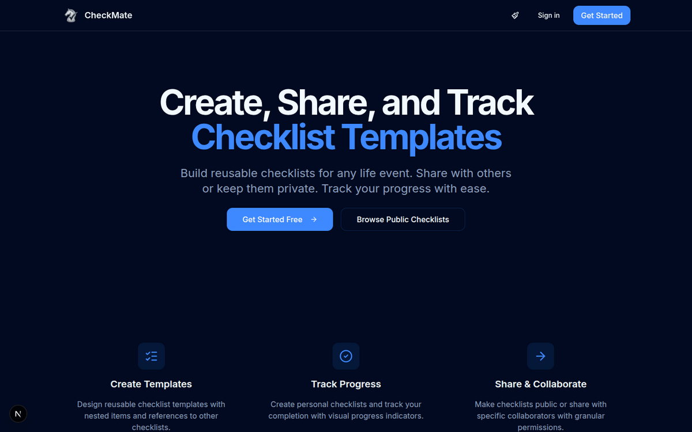
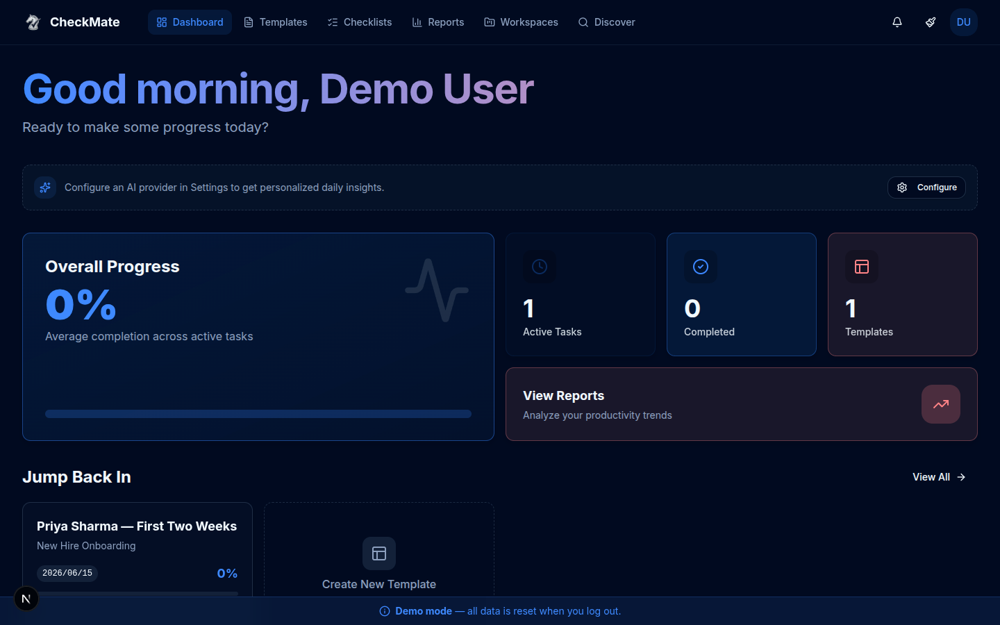
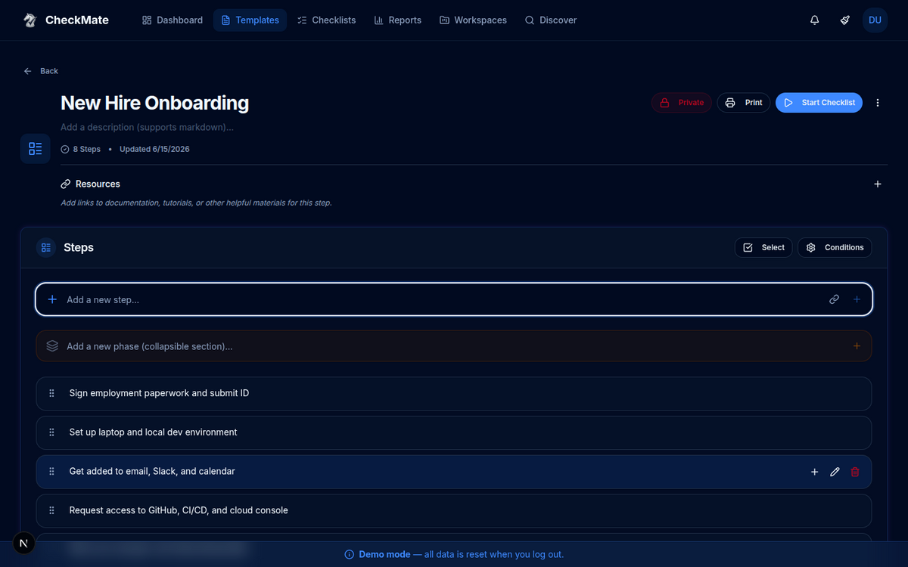
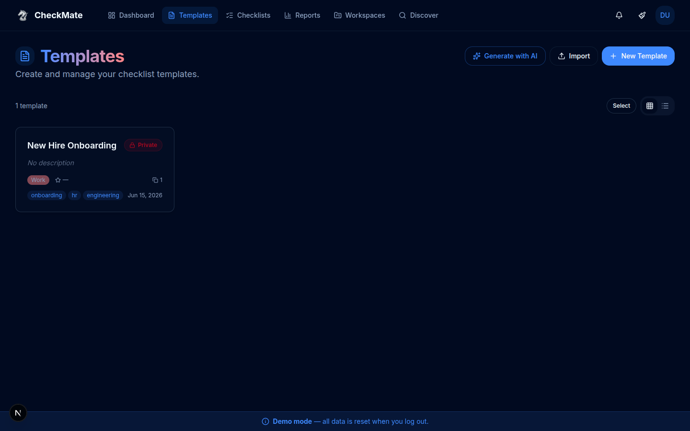
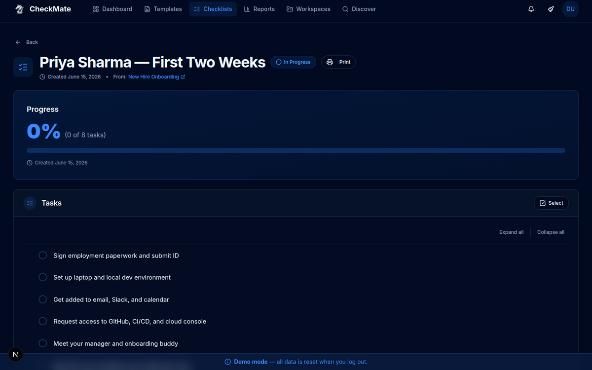
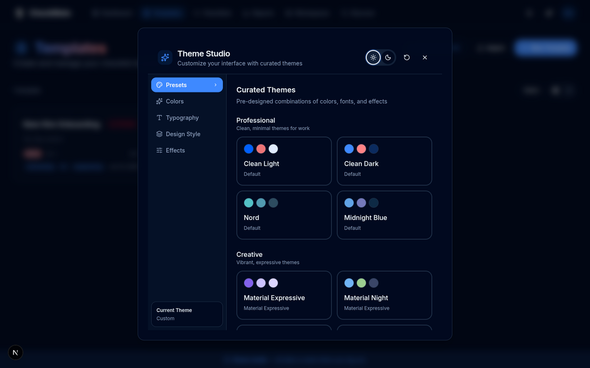

# ♟️ CheckMate — Visual Showcase

A tour of CheckMate, a modern, enterprise-grade checklist app for creating, sharing, and tracking reusable checklists. Build template **blueprints**, start tracked **instances**, organize them into **workspaces**, share with **collaborators**, and theme the whole thing to taste.

> _Screenshots captured from a local development build using the seeded demo account. Template and checklist data is illustrative._

---

## 🏠 Landing

A clean marketing landing that introduces the three core ideas — create templates, track progress, and share & collaborate.

---

## 📊 Dashboard

Your at-a-glance home: overall progress, active tasks, completed counts, templates, and quick "jump back in" actions. (Connect an AI provider for personalized daily insights.)

---

## 📝 Template Editor

Design reusable checklist **blueprints**. Add steps inline, group them into collapsible **phases**, attach **resources**, define **conditions**, reorder by drag-and-drop, and toggle public/private. Templates can reference other templates for complex, nested workflows.

---

## 📋 Templates Library

Every template you own, with category, tags, visibility, and usage — plus **Generate with AI** and **Import** options.

---

## ✅ Checklist Instance & Progress Tracking

Start a checklist from any template to create a tracked instance. Each instance shows a live **progress ring**, completion count, and an interactive task list — check items off as you go.

---

## 🎨 Theme Studio

Customize the entire interface — curated presets (Clean Light/Dark, Nord, Midnight Blue, Material Expressive/Night), plus dedicated **Colors**, **Typography**, **Design Style**, and **Effects** panels, with light/dark toggle.

---

## ✨ At a Glance

| Capability | Detail |
|------------|--------|
| **Blueprints** | Reusable templates with steps, phases, resources, and conditions |
| **Nested references** | Include checklists within checklists for complex workflows |
| **Instances** | Start tracked checklists with live progress rings and completion counts |
| **Workspaces** | Organize templates and checklists into separate spaces |
| **Collaboration** | Share with configurable permissions (viewer, editor, admin) |
| **Discovery** | Browse and search public community checklists |
| **Theming** | Theme Studio — curated presets, custom colors, typography, effects, light/dark |
| **Export/Import** | Share templates via JSON; print-friendly views |
| **Stack** | Next.js 15 (App Router), React 19, TypeScript, shadcn/ui, PocketBase |

---

_See the [README](README.md) for setup, deployment, and configuration._
